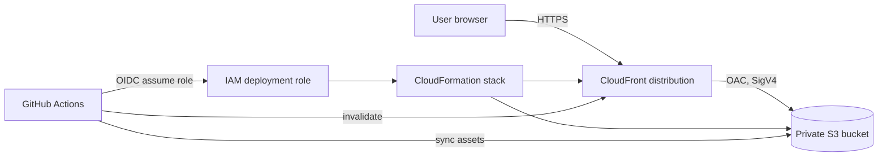
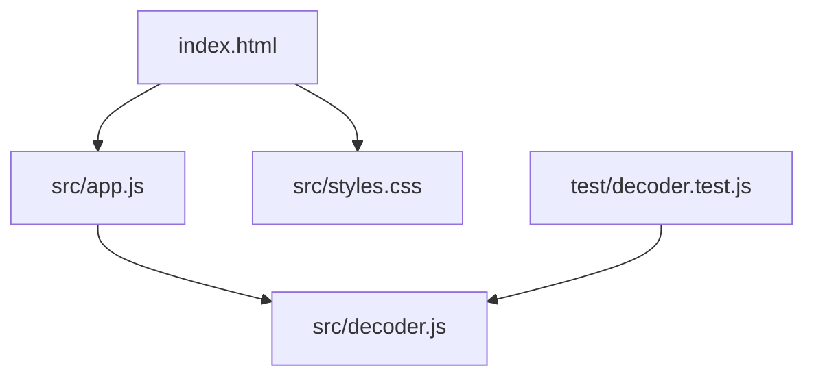
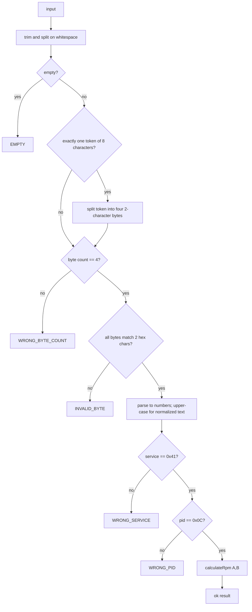
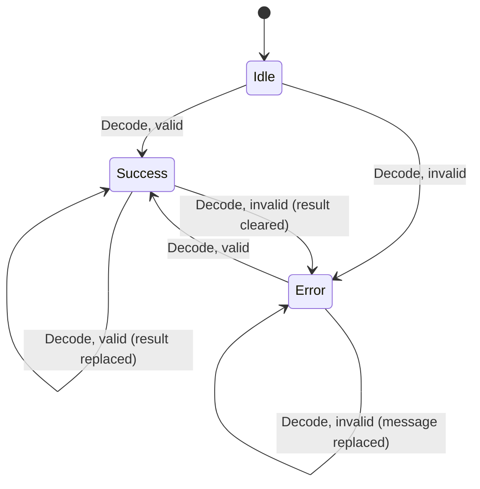
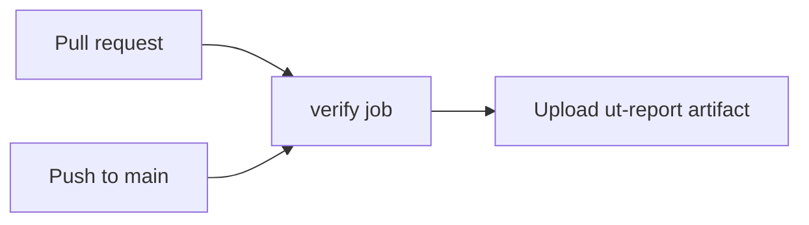

# Software Detailed Design (SWDD): RPM Lens

Source: [j1979-pid-mvp-training-requirements.md](j1979-pid-mvp-training-requirements.md)

## 1. Introduction

### 1.1 Purpose

This document describes the detailed design of RPM Lens, a browser-only tool that validates and decodes a simulated SAE J1979 Mode 01 PID 0C (engine speed) response. It is the basis for implementation, unit testing, and deployment.

### 1.2 Scope

- One single-page web application with one decoder (Mode 01, PID 0C).
- Manual entry of four hexadecimal bytes (service, PID, A, B), either space-separated or as one compact 8-digit token such as `410C1AF8` (FR-11).
- Automated verification (CI) by GitHub Actions. Static hosting on AWS (private S3 origin behind CloudFront with OAC) deployed by GitHub Actions using OIDC is designed in 2.2, 3.4 and 3.5 but is deferred: only the CI part is implemented.
- Out of scope: vehicle/adapter connectivity, other PIDs or protocols, persistence, accounts, analytics, and any diagnostic claim.

### 1.3 Definitions

| Term | Meaning |
|---|---|
| PID | Parameter ID of an OBD-II Mode 01 request/response |
| Service | First response byte; `41` for a positive Mode 01 response |
| A, B | Data bytes 3 and 4 of the response (unsigned, 0-255) |
| OAC | CloudFront Origin Access Control |
| OIDC | OpenID Connect federation between GitHub Actions and AWS IAM |

### 1.4 Design constraints

- Semantic HTML, CSS, and ES-module JavaScript; no runtime framework or external runtime library (QR-05).
- Decoder logic must be pure and DOM-free (QR-06).
- No entered data may be transmitted, stored, or logged (FR-10, QR-02).
- Tests use the Node.js built-in test runner.
- The document does not reproduce protected SAE J1979 text; the formula and identifiers are only those needed for the exercise.

## 2. Architecture

### 2.1 Architectural style

Functional core / imperative shell:

- **Core** (`decoder` module): pure functions for parsing, validation, decoding, and formatting.
- **Shell** (`app` module): reads the DOM, calls the core, renders result/error state.
- **Presentation** (`index.html`, `styles.css`): structure, accessibility semantics, and styling.

### 2.2 Context and deployment view



The browser only downloads static assets. Decoding runs locally; no request carries user input.

### 2.3 Module view



`decoder.js` has no imports and no DOM/global dependencies. `app.js` is the only module that touches the DOM.

### 2.4 Proposed repository layout

```text
/
  index.html
  src/
    decoder.js
    app.js
    styles.css
  test/
    decoder.test.js
  infra/
    site.yaml         (deferred, not yet created)
  .github/
    workflows/
      ci.yml
  tools/
    ut-csv-reporter.js
  reports/            (generated, not tracked)
  package.json
  README.md
  docs/
    swdd.md
    ut.md
    ut-testcases.csv
```

## 3. Component design

### 3.1 Decoder module (`src/decoder.js`)

**Responsibility:** convert a raw input string into a structured success or error result. Covers FR-02 to FR-07, FR-11, QR-01, QR-06.

#### 3.1.1 Constants

| Name | Value | Purpose |
|---|---|---|
| `EXPECTED_SERVICE` | `0x41` | Positive response to Mode 01 |
| `EXPECTED_PID` | `0x0C` | Engine speed |
| `EXPECTED_BYTE_COUNT` | `4` | Service, PID, A, B |
| `COMPACT_LENGTH` | `EXPECTED_BYTE_COUNT * 2` (8) | Character length of the compact single-token form (FR-11) |
| `BYTE_PATTERN` | `/^[0-9A-Fa-f]{2}$/` | Case-insensitive, applied to the raw tokens before any upper-casing, so case-mapping expansions such as U+FB00 (`ff`) cannot become valid bytes |

#### 3.1.2 Data contracts

Success result:

```text
{
  ok: true,
  bytes: [number, number, number, number],   // parsed values
  normalized: "41 0C 1A F8",                 // upper-case, single-space separated
  rpm: number,                               // e.g. 1726, 0.25
  display: "1,726 rpm"                       // formatted for the UI
}
```

Error result:

```text
{
  ok: false,
  code: "EMPTY" | "WRONG_BYTE_COUNT" | "INVALID_BYTE" | "WRONG_SERVICE" | "WRONG_PID",
  message: string                            // user-facing text from Section 5
}
```

Expected validation failures are returned, never thrown. Non-string input is treated as empty.

#### 3.1.3 Functions

| Function | Signature | Description |
|---|---|---|
| `decodeRpmResponse` | `(input: string) => Result` | Public entry point; runs the pipeline in 3.1.4 |
| `calculateRpm` | `(a: number, b: number) => number` | `((a * 256) + b) / 4` |
| `formatRpm` | `(rpm: number) => string` | Formats with `en-US` grouping, 0 to 2 fraction digits, appends ` rpm` |

`formatRpm` uses `Intl.NumberFormat("en-US", { minimumFractionDigits: 0, maximumFractionDigits: 2 })`. Because valid values are multiples of 0.25, two fraction digits never round a valid value (FR-07).

#### 3.1.4 Processing pipeline

Order is fixed (Requirements Section 8) so that results are deterministic.



Notes:

- Splitting uses `/\s+/` after `trim()`, so leading/trailing/multiple spaces are tolerated consistently.
- Compact form (FR-11): only when the trimmed input is exactly one token of exactly 8 characters (`COMPACT_LENGTH`) is that token split into four consecutive 2-character bytes. The 8 characters are not checked for hex validity at this step, so `410C1AG8` reaches the syntax check and yields `INVALID_BYTE`. After the split, the normal count, syntax, service, PID, and decode steps apply unchanged, so the compact and spaced forms give identical results and the same `normalized` value (`41 0C 1A F8`).
- Any other shape is not re-tokenized: a single token that is not 8 characters (for example `410C1A`, `410C1AF800`) and mixed grouping or extra tokens (`410C 1AF8`, `41 0C1AF8`, `410C1AF8 00`) yield `WRONG_BYTE_COUNT`.
- The byte pattern is tested on the raw token before upper-casing. Upper-casing first could turn a character such as U+FB00 into two ASCII letters and wrongly pass the check.
- Range: A, B in 0-255 gives 0 to 16,383.75 rpm.

#### 3.1.5 Worked examples

| Input | Outcome |
|---|---|
| `41 0C 1A F8` | ok, 1726, `1,726 rpm` |
| `41 0c 1a f8` | ok, normalized `41 0C 1A F8` |
| `41 0C 00 01` | ok, 0.25, `0.25 rpm` |
| `41 0C FF FF` | ok, 16383.75, `16,383.75 rpm` |
| `410C1AF8` | ok, 1726, `1,726 rpm`, normalized `41 0C 1A F8` |
| `410c1af8` | ok, normalized `41 0C 1A F8` |
| `` (empty/whitespace) | `EMPTY` |
| `41 0C F8` | `WRONG_BYTE_COUNT` |
| `41 0C 1A F8 00` | `WRONG_BYTE_COUNT` |
| `410C1A`, `410C1AF800` | `WRONG_BYTE_COUNT` |
| `410C 1AF8`, `41 0C1AF8`, `410C1AF8 00` | `WRONG_BYTE_COUNT` |
| `41 0C 1G F8` | `INVALID_BYTE` |
| `410C1AG8` | `INVALID_BYTE` |
| `41 0C <U+FB00> F8` | `INVALID_BYTE` |
| `42 0C 1A F8` | `WRONG_SERVICE` |
| `41 0D 1A F8` | `WRONG_PID` |
| `420C1AF8` | `WRONG_SERVICE` |
| `410D1AF8` | `WRONG_PID` |

### 3.2 UI controller module (`src/app.js`)

**Responsibility:** wire the form to the decoder and render state. Covers FR-01, FR-08, FR-09.

#### 3.2.1 Elements (by id)

| Id | Element | Role |
|---|---|---|
| `decode-form` | `form` | Submit handler target (Enter key and button both submit) |
| `response-input` | `input type="text"` | Response entry; labeled, `aria-describedby` points to hint and status |
| `decode-button` | `button type="submit"` | Decode action |
| `result` | `div role="status" aria-live="polite"` | Shows success or error text |

#### 3.2.2 Behavior

1. On `DOMContentLoaded`, look up elements and register a `submit` listener.
2. On submit: `preventDefault()`; clear result and error state (FR-08); call `decodeRpmResponse(input.value)`.
3. On success: render the `display` value and the accepted response `normalized`; set the result region to the success style; clear `aria-invalid` on the input.
4. On failure: render `message` in the same live region with an error style and a text prefix ("Error:"); set `aria-invalid="true"` on the input; return focus to the input.
5. Rendering uses `textContent` only; no `innerHTML` (prevents injection from user input).

#### 3.2.3 State model



Every transition clears the previous state before rendering the new one, so a stale RPM is never shown alongside an error.

### 3.3 Presentation (`index.html`, `src/styles.css`)

- Single responsive page: title, one-line description, labeled input, Decode button, result region, educational-use notice.
- The label text states the expected format ("Mode 01 PID 0C response: four hex bytes"); the hint states that spaces are optional and shows both `41 0C 1A F8` and `410C1AF8` as examples (FR-11). The placeholder is a hint only and is not auto-accepted.
- Script is loaded as `<script type="module" src="src/app.js">`.
- Status is conveyed by text as well as color; contrast meets WCAG AA (4.5:1 for body text).
- Visible focus indicator on all interactive controls; layout works from narrow mobile widths to desktop.
- No external fonts, scripts, analytics, or network calls.

### 3.4 Infrastructure (CloudFormation template, deferred)

Status: design retained; the template file is not yet in the repository and deployment is deferred, so it is not part of the current CI-only pipeline.

CloudFormation template defining:

| Resource | Key settings |
|---|---|
| S3 bucket | All public access blocked; server-side encryption; no website hosting endpoint |
| Origin Access Control | Origin type `s3`, signing behavior `always`, SigV4 |
| CloudFront distribution | Default root object `index.html`; viewer protocol `redirect-to-https`; S3 origin with OAC; compression enabled |
| Bucket policy | Allows `s3:GetObject` only to `cloudfront.amazonaws.com` with `AWS:SourceArn` equal to the distribution ARN |

Outputs: bucket name and CloudFront distribution id and domain name (used by the workflow for upload, invalidation, and reporting).

### 3.5 CI (`.github/workflows/ci.yml`)



| Job | Trigger | Steps |
|---|---|---|
| `verify` | Pull request, push to `main` | Checkout; set up Node.js 20; `node --check` on `src/decoder.js`, `src/app.js`, `test/decoder.test.js`, `tools/ut-csv-reporter.js`, `tools/review-check.js`, `tools/stage-gate.js`; `npm run review`; `npm run gate`; `npm test`; upload `reports/ut-report.csv` as an artifact (also when tests fail) |

Stage freeze: `tools/review-check.js` automates the mechanical review checks per stage (requirements, SWDD, UT design, tests, code): unique requirement IDs, requirement-to-design and requirement-to-test traceability, agreement of `docs/ut.md`, the CSV and the test code, error messages equal to section 5, and referenced files existing. `tools/stage-gate.js` stores a SHA-256 hash of each stage in `docs/stage-baseline.json` with the reviewer, the date, and the hashes of the upstream stages it was reviewed against. The stage order is requirements, SWDD, UT design, tests, code (code also depends on the SWDD and the UT design). `verify` fails when a stage changed after it was frozen, or when an upstream stage changed and the stage was not re-frozen. `freeze` refuses when the stage's review checks fail, when an upstream stage is not frozen, or when the upstream did not change (unless `--amend` records a reason), so a frozen stage stays frozen until a requirement is added or modified. The judgment-based review skills are not run in CI.

Security settings: workflow permissions `contents: read` only; no secrets, no cloud credentials.

Deferred (CD): an AWS deploy job (OIDC role, CloudFormation deploy, `s3 sync`, CloudFront invalidation) is not part of the current pipeline. If added later it needs `id-token: write` on that job only, a trust policy restricted to this repository's `main` branch, and least-privilege role permissions.

## 4. Requirements traceability

| Requirement | Design element |
|---|---|
| FR-01 | 3.2.1 form, input, button; 3.3 label and format text |
| FR-02 | 3.1.4 case-insensitive byte pattern, normalization, and space splitting |
| FR-03 | 3.1.4 EMPTY, WRONG_BYTE_COUNT, INVALID_BYTE |
| FR-04 | 3.1.4 WRONG_SERVICE |
| FR-05 | 3.1.4 WRONG_PID |
| FR-06 | 3.1.3 `calculateRpm`; 3.1.5 examples |
| FR-07 | 3.1.3 `formatRpm` |
| FR-08 | 3.2.2 step 2; 3.2.3 state model |
| FR-09 | 3.2.1 label, `role="status"`, `aria-live`, `aria-invalid`; 3.3 focus and contrast |
| FR-10 | 2.2 and 3.3: no network calls; decoding in the browser |
| FR-11 | 3.1.1 `COMPACT_LENGTH`; 3.1.4 compact split step and notes; 3.1.5 examples; 3.3 hint text |
| QR-01 | 3.1.4, 6.1 unit tests |
| QR-02 | 3.2.2 step 5; 3.3 no analytics; 7 |
| QR-03 | 3.2.1, 3.3, 6.2 |
| QR-04 | 3.3 standard HTML/CSS/ES modules only; 6.2 |
| QR-05 | 1.4 no runtime dependencies |
| QR-06 | 2.1, 2.3, 3.1 |
| QR-07 | 3.5 CI (verification); 3.4 and the deferred CD part of 3.5 (deployment) |
| QR-08 | 3.4 blocked public access, OAC, bucket policy (deferred with deployment) |

## 5. Error messages

| Code | Message |
|---|---|
| `EMPTY` | Enter four hexadecimal bytes, for example: 41 0C 1A F8. |
| `WRONG_BYTE_COUNT` | Enter exactly four bytes: service, PID, A, and B. |
| `INVALID_BYTE` | Each byte must contain exactly two hexadecimal characters. |
| `WRONG_SERVICE` | This is not a positive response for Mode 01; expected service 41. |
| `WRONG_PID` | This response is for a different PID; expected 0C (engine speed). |

Messages are plain language, contain no stack traces, and are the only user-visible error text.

## 6. Test design

### 6.1 Decoder unit tests (`test/decoder.test.js`)

The detailed unit test design, test data, and traceability are in [ut.md](ut.md) and [ut-testcases.csv](ut-testcases.csv). Summary of the design intent:

- Valid vectors: reference, boundaries, lowercase, whitespace, and the compact form (FR-11).
- Invalid vectors for each error code, including compact-form length, content, service, PID, and mixed grouping.
- Precedence: empty, then byte count, then syntax, then service, then PID.
- `formatRpm`, non-string input, result and error contract, purity of the decoder module.

### 6.2 UI and deployment checks (manual)

| Check | Procedure | Expected |
|---|---|---|
| Smoke | Load the deployed URL, decode the example | `1,726 rpm` displayed |
| Compact input | Enter `410C1AF8` and activate Decode; read the hint text | `1,726 rpm` and accepted response `41 0C 1A F8` displayed; hint says spaces are optional |
| Error and stale-state | Decode valid input, then invalid input | Error shown; old RPM gone |
| Keyboard | Tab to input, type, press Enter/activate Decode | Result shown and announced |
| Accessibility scan | Automated scan if available | No critical violations |
| Privacy | Inspect browser network panel while decoding | No requests carrying input |
| Compatibility | Repeat smoke test in one current Chrome, Edge, or Firefox | Same result |
| Infrastructure | Review template and IAM role | Private bucket, OAC, HTTPS redirect, least privilege |

## 7. Security and privacy design

- Entered bytes exist only in the input element and local variables; they are not stored (no `localStorage`, cookies, or logs) and not sent over the network.
- No `innerHTML`, `eval`, or dynamic script loading; results rendered with `textContent`.
- No third-party runtime scripts, fonts, or analytics.
- S3 origin is private; CloudFront enforces HTTPS redirect.
- Deployment uses short-lived OIDC credentials scoped to the repository and branch.
- The page shows an educational-use notice and makes no J1979 conformance or diagnostic claim.

## 8. Assumptions and open items

- "ITID /PID" is interpreted as an OBD-II PID; Mode 01 PID 0C is the target. Confirm with the requester.
- The service, PID, and formula must be verified against an authorized, current SAE J1979 reference before any production use.
- Requirement wording for FR-07 is satisfied by `en-US` grouping with up to two fraction digits; a different locale is not required.
- Extending to other PIDs would require introducing a decoder registry; this is intentionally deferred.
- Decision (FR-11): number formatting (`formatRpm`, `display`) stays in the decoder module, as designed in 3.1; it is not moved to the UI layer.
- Open: the whitespace split uses `\s`, which also accepts Unicode spaces such as NBSP. The requirements are silent; this is treated as tolerated behavior until the requester decides otherwise.
